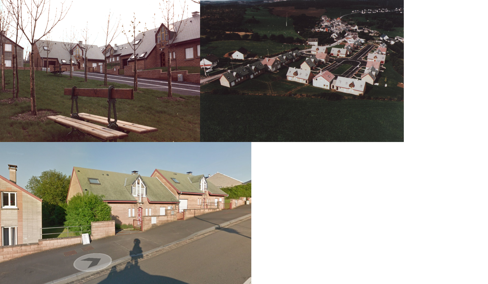
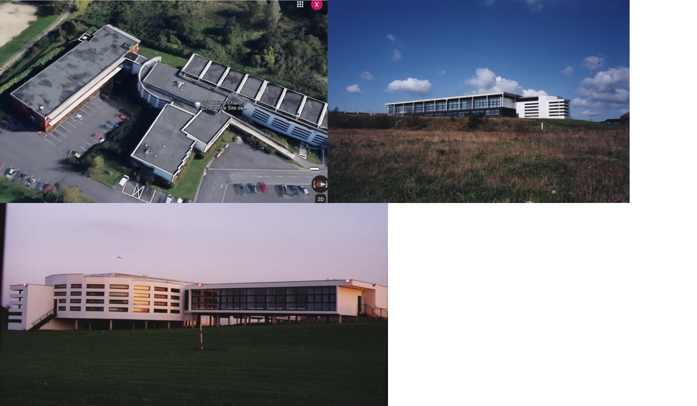
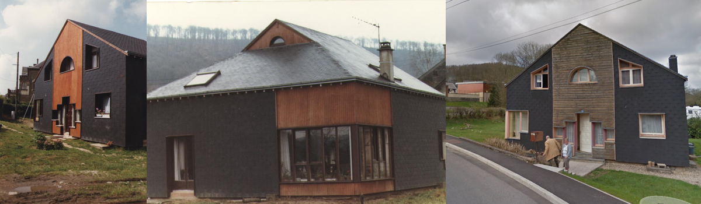
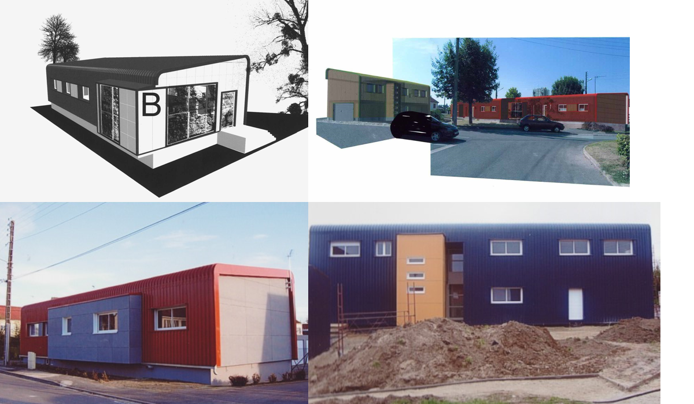
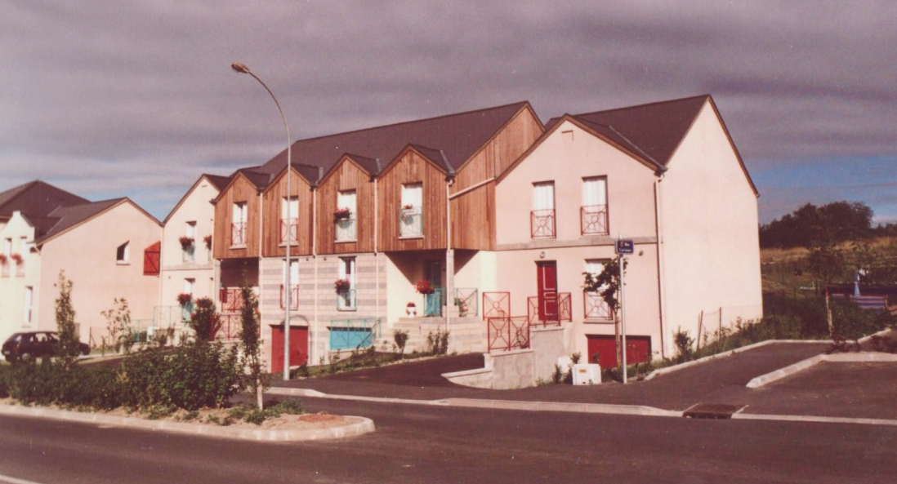

.. _gillesduprerst:

====================================
Gilles Dupré - oeuvre architecturale
====================================

Cette page regroupe de nombreux projets architecturaux
de mon père, Gilles Dupré, constuits dans la région Grand Est.
Les photos mélangent des photos d'archives et des photos tirées de
Google Maps. La plupart des lieux sont localisés.

J'ai passé pas mal de temps à parcourir les rues avec Google Street View,
à regarder les cartes IGN, plus précises que celles de Google,
à m'extasier devant les `traces GPS d'OpenStreetMap
<https://www.openstreetmap.org/traces>`_, inutiles pour ma recherche,
mais intrigantes.

Je n'imaginais que faire la liste des constructions de mon
père, soit aussi fastidieuse. Les adresses des constructions sont
rarement notées. J'ai passé pas mal de temps à chercher un toit
dans le village de Lonny qui puisse ressembler à une maison
que je ne connaissais que grâce à deux photos. J'ai sillonné virtuellement
dans les rues du village depuis Paris, en me demandant si sa maison
n'avait pas été détruite ou refaite de façon méconnaissable.
Je n'ai pas retrouvé la trace d'une maison qu'il a aménagé à Carolles.
Je sais pourtant qu'elle existe puisque j'y ai déjeuné il y a très longtemps.
Je me souviens encore du premier étage, une avancée courbe en surplomb du
de la salle à manger.

Témoin du temps qui passe, j'ai mis les pieds dans trois maisons
que mon père a construite. Toutes étaient en bordure de village
à l'époque où elles furent construites. Elles ne le sont
plus maintenant.

.. contents::
    :local:

Bâtiments
---------

1976 - Base nautique des Vieilles Forges
~~~~~~~~~~~~~~~~~~~~~~~~~~~~~~~~~~~~~~~~

-  `localisation <https://www.google.com/maps/place/Centre+de+Congres+des+Vieilles-Forges/@49.8729286,4.5991102,16.08z/data=!4m13!1m7!3m6!1s0x47ea065d0440a417:0x1ee1d9ab6e1d1b65!2sLac+des+Vieilles+Forges!3b1!8m2!3d49.8697736!4d4.6050622!3m4!1s0x47ea0658fafbdae3:0x994a629ddc85a56a!8m2!3d49.873301!4d4.600471>`__
-  publication dans la revue AC en 1981

.. image:: gilles_dupre_5_0.png
   :width: 1200px

1978 - Base nautique de Bairon
~~~~~~~~~~~~~~~~~~~~~~~~~~~~~~

- rénovation ou destruction `Au lac de Bairon, la base départementale sera rasée
  <https://www.lardennais.fr/id257821/article/2021-05-17/au-lac-de-bairon-la-base-departementale-sera-rasee>`__
- publication dans le Guide de l'Architecture en France, 1945-1983, éd.
  du Moniteur

.. image:: gilles_dupre_7_0.jpg
   :width: 1200px

1980 - Caserne gendarmerie - Raucourt
~~~~~~~~~~~~~~~~~~~~~~~~~~~~~~~~~~~~~

-  `localisation <https://www.google.com/maps/place/Gendarmerie+Nationale/@49.6045683,4.956929,464m/data=!3m1!1e3!4m12!1m6!3m5!1s0x47ea694b72489517:0x44e8feab6346d862!2sGendarmerie+Nationale!8m2!3d49.6047433!4d4.9568822!3m4!1s0x47ea694b72489517:0x44e8feab6346d862!8m2!3d49.6047433!4d4.9568822!%5Bimage.png%5D(attachment:image.png)>`__
-  Maître d'ouvrage : département des Ardennes
-  Mission M2

.. image:: gilles_dupre_9_0.png
   :width: 1200px

1983 - PARC DEPARTEMENTAL DE L'EQUIPEMENT DES ARDENNES
~~~~~~~~~~~~~~~~~~~~~~~~~~~~~~~~~~~~~~~~~~~~~~~~~~~~~~

-  `localisation <https://www.google.com/maps/place/7+Rue+Albert+Caquot,+08000+Charleville-M%C3%A9zi%C3%A8res/@49.7517558,4.7073903,285m/data=!3m2!1e3!4b1!4m5!3m4!1s0x47ea11e455ad36e5:0x2b18049c4671bdb9!8m2!3d49.751754!4d4.708515>`__
-  Maître d'ouvrage : DDE des Ardennes
-  Année : 1983
-  Surface : 4 612 m²
-  Coût : 1 234 837 €

1984 - 23 pavillons à Rancennes
~~~~~~~~~~~~~~~~~~~~~~~~~~~~~~~

-  `localisation <https://www.google.com/maps/place/08600+Rancennes/@50.1146633,4.8199199,18.94z/data=!4m5!3m4!1s0x47c1e8e5023613a7:0xe4445033e700b7d2!8m2!3d50.11698!4d4.816853>`__
-  Maître de l'ouvrage Régie Foncière E.D.F
-  Coût 12 MF
-  Réalisation 1983-1984
-  Mission Mission M1
-  Surface 3.000 m²

1984 - Cinéma à Hirson
~~~~~~~~~~~~~~~~~~~~~~

-  `localisation <https://www.google.com/maps/place/Le+Sonhir+3/@49.9200295,4.0843362,19z/data=!4m12!1m6!3m5!1s0x47e9e071e1d87127:0xdf880b4c564e3974!2sLe+Sonhir+3!8m2!3d49.9200301!4d4.0840951!3m4!1s0x47e9e071e1d87127:0xdf880b4c564e3974!8m2!3d49.9200301!4d4.0840951>`__

.. image:: gilles_dupre_17_0.png
   :width: 1200px

1984 - Salle de spectacles à Revin
~~~~~~~~~~~~~~~~~~~~~~~~~~~~~~~~~~

-  `localisation <https://www.google.com/maps/place/salle+Jean+Villard/@49.9385289,4.6327765,19.25z/data=!4m9!1m2!2m1!1ssalle+de+spectacle+revin!3m5!1s0x47c1fd682ef5cd27:0x1c3104aef849a123!8m2!3d49.9388203!4d4.6325125!15sChhzYWxsZSBkZSBzcGVjdGFjbGUgcmV2aW6SARFyZWNyZWF0aW9uX2NlbnRlcg>`__
-  Maître de l'ouvrage : Ville de Revin
-  Coût : 6 MF
-  Mission : Mission M1
-  Surface : 1.200 m²

1985 - Groupe Scolaire à Givet
~~~~~~~~~~~~~~~~~~~~~~~~~~~~~~

-  `localisation <https://www.google.com/maps/place/Public+Nursery+School+Charles+De+Gaulle/@50.1358163,4.8362679,17.59z/data=!4m9!1m2!2m1!1secole+givet!3m5!1s0x47c1e90e374ba83d:0xbfe358790cef9e43!8m2!3d50.1358015!4d4.8367716!15sCgtlY29sZSBnaXZldJIBCXByZXNjaG9vbA>`__
-  Maître d'ouvrage : Ville de Givet
-  Dévolution: Concours
-  Coût : 14 MF

1985 - Gymnase les Mazures
~~~~~~~~~~~~~~~~~~~~~~~~~~

-  `localisation <https://www.google.com/maps/place/Gymnase/@49.8892448,4.6217422,18.21z/data=!4m9!1m2!2m1!1sgymnase+les+mazures!3m5!1s0x47ea07ca6536917b:0x974a165ae92cbdea!8m2!3d49.8898799!4d4.622113!15sChNneW1uYXNlIGxlcyBtYXp1cmVzWhUiE2d5bW5hc2UgbGVzIG1henVyZXOSAQ5zcG9ydHNfY29tcGxleJoBJENoZERTVWhOTUc5blMwVkpRMEZuU1VOTmFXUnRNalZuUlJBQg>`__
-  Maître d'ouvrage : Commune de LES MAZURES
-  Surface : Aire de sport : 1 160 m², Foyer - club : 140 m² Annexes :
   900 m²
-  Coût : 789 239 €
-  Mode de dévolution : Appel d'offre ouvert

.. image:: gilles_dupre_21_0.png
   :width: 1200px

1986 - Service restauration du centre spécialisé de Bélair
~~~~~~~~~~~~~~~~~~~~~~~~~~~~~~~~~~~~~~~~~~~~~~~~~~~~~~~~~~

-  `localisation <https://www.google.com/maps/place/Hospital+Center+B%C3%A9lair/@49.7904671,4.7220207,19.35z/data=!4m5!3m4!1s0x47ea095efb8b1ffb:0x3c2dffd56dcbea4c!8m2!3d49.7880906!4d4.7219877>`__
-  Maître de l'ouvrage : Centre Hospitalier de Bélair.
-  Maître d'oeuvre : G.Dupré
-  Mission : M1
-  Coût : 7 MF
-  Surface : 1.500 m²
-  Nombre de couverts : 600

1987 - Bureau de poste à la Francheville
~~~~~~~~~~~~~~~~~~~~~~~~~~~~~~~~~~~~~~~~

-  `localisation <https://www.google.com/maps/place/Post+Office/@49.7283171,4.7121691,19.52z/data=!4m5!3m4!1s0x47ea118f627e325d:0x3c607c665f99224c!8m2!3d49.7284104!4d4.712119>`__
-  Maître d'ouvrage : Commune de La Francheville
-  Surface : 236 m²
-  Coût : 152 449 €
-  Mode de dévolution : Sur dossier

1988 - Hôtel de Police de Reims
~~~~~~~~~~~~~~~~~~~~~~~~~~~~~~~

-  `localisation <https://www.google.com/maps/place/HOTEL+DE+REIMS+POLICE/@49.2560259,4.0192044,17z/data=!4m12!1m6!3m5!1s0x47e9750034b78e27:0x9063442805342fc4!2sHOTEL+DE+REIMS+POLICE!8m2!3d49.2559405!4d4.0212786!3m4!1s0x47e9750034b78e27:0x9063442805342fc4!8m2!3d49.2559405!4d4.0212786>`__
-  Maître d'ouvrage : Ministère de l'Intérieur - SGAP DE METZ
-  Coût H.T. : 11 586 125 €
-  Maîtrise d'oeuvre : Cabinet Gilles DUPRE, architecte CHODACZEK, BET
-  Surface : 12 167 m²

.. image:: gilles_dupre_27_0.png
   :width: 1200px

1990 - Extension du lycée Chanzy à Charleville
~~~~~~~~~~~~~~~~~~~~~~~~~~~~~~~~~~~~~~~~~~~~~~

-  `localisation <https://www.google.com/maps/place/School+Chanzy/@49.7734575,4.7277675,17z/data=!4m12!1m6!3m5!1s0x47ea0de3c9938e19:0xe03be86a792ca239!2sSchool+Chanzy!8m2!3d49.7734575!4d4.7299562!3m4!1s0x47ea0de3c9938e19:0xe03be86a792ca239!8m2!3d49.7734575!4d4.7299562>`__
-  Maître de l'ouvrage : Région Champagne Ardenne
-  Coût : 762 245 €

.. image:: gilles_dupre_29_0.png
   :width: 1200px

1992 - Lycée d'Enseignement Général et Technique Châlons sur Marne
~~~~~~~~~~~~~~~~~~~~~~~~~~~~~~~~~~~~~~~~~~~~~~~~~~~~~~~~~~~~~~~~~~

-  `localisation <https://www.google.com/maps/place/Comprehensive+School+Jean+Talon/@48.9550968,4.3390697,17z/data=!4m12!1m6!3m5!1s0x47ebe076b19b6db7:0xd884d5d78bca2ed7!2sComprehensive+School+Jean+Talon!8m2!3d48.9552753!4d4.3407856!3m4!1s0x47ebe076b19b6db7:0xd884d5d78bca2ed7!8m2!3d48.9552753!4d4.3407856>`__
-  Maître d'ouvrage : Région Champagne-Ardenne
-  Dévolution Concours
-  Réalisation 1993/1994
-  Coût 95 MF
-  Associés Gottardi-Claudel (suivi de chantier)

1993 - Extension et réhabilitation de la station d'épuration de Charleville-Mézières
~~~~~~~~~~~~~~~~~~~~~~~~~~~~~~~~~~~~~~~~~~~~~~~~~~~~~~~~~~~~~~~~~~~~~~~~~~~~~~~~~~~~

-  `localisation <https://www.google.com/maps/search/station+d'%C3%A9puration+charleville/@49.7662495,4.7302367,20.95z>`__
-  Maître de l'ouvrage Ville de Charleville-Mézières
-  Coût 6 MF

1995 - Equipements sportifs au Lycée J.Talon à Châlons-en-Champagne
~~~~~~~~~~~~~~~~~~~~~~~~~~~~~~~~~~~~~~~~~~~~~~~~~~~~~~~~~~~~~~~~~~~

-  `localisation <https://www.google.com/maps/place/Gymnase+Jean+Talon/@48.9575318,4.3344374,18z/data=!4m9!1m2!2m1!1slycee+jean+talon+chalons+gymnase!3m5!1s0x47ebe0751ade29fb:0x39f806ecbee709db!8m2!3d48.9570918!4d4.3347077!15sCiBseWNlZSBqZWFuIHRhbG9uIGNoYWxvbnMgZ3ltbmFzZZIBA2d5bQ>`__
-  Maître de l'ouvrage Région Champagne Ardenne
-  Surface 1.900 m²
-  Coût 1 021 408.00 €
-  Réalisation 1995 Concours
-  Mission MOP - Mission de base

1998 - Extension du groupe scolaire Gambetta à Rethel (08)
~~~~~~~~~~~~~~~~~~~~~~~~~~~~~~~~~~~~~~~~~~~~~~~~~~~~~~~~~~

-  `localisation <https://www.google.com/maps/place/Public+Primary+School+Gambetta/@49.5035151,4.3600878,304m/data=!3m1!1e3!4m9!1m2!2m1!1slycee+gambetta+rethel!3m5!1s0x47e989bcfb3e9b01:0xb7cb8d5a3b15b80b!8m2!3d49.5041509!4d4.3606818!15sChVseWNlZSBnYW1iZXR0YSByZXRoZWySAQZzY2hvb2w>`__
-  Maître d'ouvrage : ville de Rethel
-  Gilles Dupré et Caroline De Zotti
-  Montant : 2,7 MF

1998 - Extension du complexe sportif de la poterie Prix les mézières
~~~~~~~~~~~~~~~~~~~~~~~~~~~~~~~~~~~~~~~~~~~~~~~~~~~~~~~~~~~~~~~~~~~~

-  `localisation <https://www.google.com/maps/place/Stade+de+la+Poterie/@49.7507784,4.687482,18.26z/data=!4m12!1m6!3m5!1s0x47ea11dabecb1edd:0x4f3aadaff5507892!2sStade+de+la+Poterie!8m2!3d49.7507349!4d4.6885698!3m4!1s0x47ea11dabecb1edd:0x4f3aadaff5507892!8m2!3d49.7507349!4d4.6885698!%5Bimage.png%5D(attachment:image.png)>`__
-  Maître d'ouvrage : Commune de Prix Les Mézières
-  Surface : 244 m²
-  Coût : 114 337 €
-  Mode de dévolution : Marché public de prestations

.. image:: gilles_dupre_41_0.png
   :width: 1200px

1999 - Restructuration Commissariat Saint-Dizier
~~~~~~~~~~~~~~~~~~~~~~~~~~~~~~~~~~~~~~~~~~~~~~~~

-  `localisation <https://www.google.com/maps/place/Police+station/@48.63985,4.9623089,18.46z/data=!4m12!1m6!3m5!1s0x47eb80f64c416adf:0x28049fc37bea43c4!2sPolice+station!8m2!3d48.6396677!4d4.9626724!3m4!1s0x47eb80f64c416adf:0x28049fc37bea43c4!8m2!3d48.6396677!4d4.9626724>`__
-  Maître d'ouvrage : Ministère de l'Intérieur - SGAP DE METZ
-  Coût H.T. : 686 021 €
-  Maîtrise d'œuvre : Cabinet Gilles DUPRE, architecte GECIBAT, BET
   Structure, BECIT, BET Fluides MANESSE, BET
-  Surface : 1 300 m²

.. image:: gilles_dupre_43_0.png
   :width: 1200px

2002 - Collège Léo Lagrange - Création d'un préau
~~~~~~~~~~~~~~~~~~~~~~~~~~~~~~~~~~~~~~~~~~~~~~~~~

- `localisation <https://www.google.com/maps/place/Middle+School+L%C3%A9o+Lagrange/@49.744489,4.7195379,18z/data=!4m12!1m6!3m5!1s0x47ea11f66f3e87c1:0x3dd100c01122153f!2sMiddle+School+L%C3%A9o+Lagrange!8m2!3d49.7444397!4d4.7202268!3m4!1s0x47ea11f66f3e87c1:0x3dd100c01122153f!8m2!3d49.7444397!4d4.7202268?hl=en>`__
- Maître d'ouvrage : Conseil Général des Ardennes
- Coût : 152 450€
- Mission : création d'un préau, travaux d'entretien et rénovation

.. image:: gilles_dupre_45_0.png
   :width: 1200px

2004 - Salle Omnisport à Lumes
~~~~~~~~~~~~~~~~~~~~~~~~~~~~~~

-  `localisation <https://www.google.com/maps/search/salle+omnisport+lumes/@49.7357627,4.7860832,19.3z!%5Bimage.png%5D(attachment:image.png)>`__
   - chemin de l'Etang 08000 Lumes (adresse de l'époque)
-  Maître d'ouvrage : Communauté de Communes des Balcons de Meuse
-  Dévolution Concours - Mission de base avec EXE
-  Coût 914 694.10 €
-  Surface 1.600 M²

2005 - IUT à Charleville
~~~~~~~~~~~~~~~~~~~~~~~~

-  `localisation <https://www.google.com/maps/place/IUT+Reims+Chalons+Charleville/@49.7400483,4.7180968,17z/data=!4m12!1m6!3m5!1s0x47ea11f53746e8d9:0x60ec94c9ed6dbe33!2sIUT+Reims+Chalons+Charleville!8m2!3d49.7400483!4d4.7202855!3m4!1s0x47ea11f53746e8d9:0x60ec94c9ed6dbe33!8m2!3d49.7400483!4d4.7202855>`__
-  Maître de l'ouvrage Rectorat de l'Académie de Reims 1 rue Navier -
   51092 REIMS CEDEX
-  Maître d'ouvrage délégué D.D.E des Ardennes
-  Maître d'œuvre Gilles Dupré (conception et réalisation)
-  Coût 1 905 613 €
-  Mission Mission de base avec exécution Surface 1.700 m²

2008 - Centre Hospitalier de Rethel
~~~~~~~~~~~~~~~~~~~~~~~~~~~~~~~~~~~

-  `localisation <https://www.google.com/maps/place/Ghsa+-+Hospital+De+Rethel/@49.5113383,4.3629599,18.96z/data=!4m12!1m6!3m5!1s0x47e9898c24bcb0e9:0xf779a40a16c1cbe0!2sGhsa+-+Hospital+De+Rethel!8m2!3d49.5111436!4d4.3630286!3m4!1s0x47e9898c24bcb0e9:0xf779a40a16c1cbe0!8m2!3d49.5111436!4d4.3630286>`__
-  Maître de l'ouvrage Centre Hospitalier de RETHEL
-  Maître d'ouvrage délégué D.D.E des Ardennes
-  Maître d'œuvre Gilles Dupré (conception et réalisation)
-  Coût 914 694.10 €
-  Réalisation 1996
-  Mission Mission loi MOP
-  Surface 1000 m²

.. image:: gilles_dupre_51_0.png
   :width: 1200px

2011 - 30 logements rue des mésanges à Charleville
~~~~~~~~~~~~~~~~~~~~~~~~~~~~~~~~~~~~~~~~~~~~~~~~~~

-  `localisation <https://www.google.com/maps/@49.7474834,4.7207249,20.24z>`__
-  Maître d'ouvrage : Espace Habitat

.. image:: gilles_dupre_53_0.png
   :width: 1200px

2012 - Commissariat de Police à Charleville
~~~~~~~~~~~~~~~~~~~~~~~~~~~~~~~~~~~~~~~~~~~

-  `localisation <https://www.google.com/maps/place/Police/@49.7696802,4.722223,19.44z/data=!4m12!1m6!3m5!1s0x47ea0e08916fb455:0xdbb4e4c100c8fe29!2sPolice!8m2!3d49.7697673!4d4.7227286!3m4!1s0x47ea0e08916fb455:0xdbb4e4c100c8fe29!8m2!3d49.7697673!4d4.7227286>`__
-  Maître d'ouvrage : Ministère de l'Intérieur - SGAP DE METZ
-  Coût H.T. : 3 928 870 €

Maisons individuelles
---------------------

Maison Borrewater (non localisée)
~~~~~~~~~~~~~~~~~~~~~~~~~~~~~~~~~

.. image:: gilles_dupre_58_0.png
   :width: 1200px

Neufmanil (Maison Dequen, avant 1990)
~~~~~~~~~~~~~~~~~~~~~~~~~~~~~~~~~~~~~

-  `localisation <https://www.google.com/maps/place/Rue+Jules+Ferry,+08700+Neufmanil/@49.8121253,4.7944592,19.29z/data=!4m5!3m4!1s0x47ea0cf1e5768d3f:0x853ba72f454442a5!8m2!3d49.8114565!4d4.7940879>`__

1998 - Maison La Francheville (Courty)
~~~~~~~~~~~~~~~~~~~~~~~~~~~~~~~~~~~~~~

-  `localisation <https://www.google.com/maps/place/82+Rue+du+Fort,+08000+La+Francheville/@49.7251482,4.7212073,17z/data=!4m13!1m7!3m6!1s0x47ea12291cf0b84f:0x717048e01b34ce1!2s82+Rue+du+Fort,+08000+La+Francheville!3b1!8m2!3d49.7251482!4d4.723396!3m4!1s0x47ea12291cf0b84f:0x717048e01b34ce1!8m2!3d49.7251482!4d4.723396>`__

.. image:: gilles_dupre_62_0.png
   :width: 1200px

Maison particulière à Vrigne aux Bois (non localisée)
~~~~~~~~~~~~~~~~~~~~~~~~~~~~~~~~~~~~~~~~~~~~~~~~~~~~~

5 logements, 3 garages (non localisé)
~~~~~~~~~~~~~~~~~~~~~~~~~~~~~~~~~~~~~

-  Maître d'ouvrage : O.P.A.C. de Châlons en Champagne
-  Surface : Logements : 847m², Aménagement : 31 402 m²
-  Coût : 737 916 €
-  Mode de dévolution : Appel à candidature

Maison à Lonny (non datée)
~~~~~~~~~~~~~~~~~~~~~~~~~~~~~~~~~~~~~~~~~

* `localisation probable
  <https://www.google.com/maps/place/Lonny/@49.8112243,4.5862864,285m/data=!3m1!1e3!4m5!3m4!1s0x47ea04520f16ebad:0x40a5fb99a3f71d0!8m2!3d49.816104!4d4.586362>`_,
  les vues du ciel de l'IGN sont plus précises
  `Lonny <https://www.geoportail.gouv.fr/plan/08260/lonny>`_, qu'on retrouve sur
  `Bing Maps (Lonny) <https://www.bing.com/maps?osid=4942cc51-b528-4741-9ebc-074c478365f6&cp=49.811398~4.586053&lvl=19&style=h&v=2&sV=2&form=S00027>`_

.. image:: gilles_dupre_68_0.png
   :width: 1200px

11 logements à Givet (non datés, non localisé)
~~~~~~~~~~~~~~~~~~~~~~~~~~~~~~~~~~~~~~~~~~~~~~

-  Maître d'ouvrage : Espace Habitat

Réhabilitation de 5 logements dans un corps de ferme à Rocroi (non daté, non localisé)
~~~~~~~~~~~~~~~~~~~~~~~~~~~~~~~~~~~~~~~~~~~~~~~~~~~~~~~~~~~~~~~~~~~~~~~~~~~~~~~~~~~~~~

-  Maître d'ouvrage : OPAC des Ardennes

.. image:: gilles_dupre_72_0.png
   :width: 1200px

1993 - Réalisation de 90 logements à Reims (non localisé)
~~~~~~~~~~~~~~~~~~~~~~~~~~~~~~~~~~~~~~~~~~~~~~~~~~~~~~~~~

-  Maître d'ouvrage : effort Rémois
-  Réalisation de 90 logements à Reims (51)
-  Maître de l'ouvrage L'Effort Rémois
-  Coût 43 MF
-  Prestations Conception-Réalisation Avec S.P.I.E

Ponts
-----

Pont Rethel : contournante de Rethel
~~~~~~~~~~~~~~~~~~~~~~~~~~~~~~~~~~~~

.. image:: gilles_dupre_77_0.jpg
   :width: 1200px
