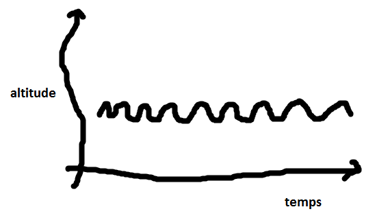
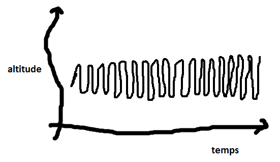

.. index:: Big Data, données, téléphone

.. _l-histoire_telephone:

La journée de Téléphone
=======================

**+8 ans**

:sharenet:`facebook-twitter-linkedin-20-body`

Cette histoire est fictive mais tout-à-fait envisageable avec les
technologie d'aujourd'hui. Nous sommes en 2016. La plupart des idées
mentionnées dans l'histoire arriveront dans les années qui viennent.

**7h00** Il est sept heures. Je sonne. Je commence par une symphonie de Beethoven.
Il aime bien ce réveil.

**7h06** Premier texto, Dumbo est réveillé. *"Il a fait un rêve de ouf."*
Je ne comprends pas ce que ça veut dire. Mais Dumbo est ponctuel comme
à son habitude. Son message est à 95% identique à ceux qu'il envoie
tous les jours à la même heure. Pas besoin de s'inquiéter.

**7h08** Dans 80% des cas, Blanche-Neige a l'habitude de répondre dans les deux minutes.
Elle ne l'a pas encore fait.

**7h10** Blanche-Neige a répondu. *C'est ouf.* Tout va bien. Pluto
ne s'est pas manifesté mais il ne le fait que dans 10% des cas.

**7h15** Je lance la deuxième sonnerie. Bob Dylan.

**7h25** Je pense qu'une main m'agrippe. Mon détecteur de vibrations
a détecté du mouvement. Moins d'une seconde plus tard, je sens de la chaleur.
Ca y est, je suis dans une poche.

**7h26** Le taux d'humidité est assez élevé. Je pense qu'il a pris une douche.

**7h30** J'ai enregistré mes mouvements. D'après mon analyse, je pense
me trouver dans la poche du pantalon.

**7h31** Plus du tout de mouvement, chaleur toujours ok. il est assis.

**7h32** Je vérifie le jour. Mardi. Pas de vacances. Je vérifie sur
le calendrier de l'école fourni en ligne. Programme habituel. Il
va à l'école donc. Je vérifie les horaires de bus. Pas de retard prévu.
Je prévois de faire sonner à 7h35 s'il ne s'est pas levé de table.

**7h34** Il s'est levé de lui-même. Il bouge, il s'arrête. Il
met ses chaussures. Il bouge à nouveau. La température change rapidement.
Il est dehors. Il marche. Je regarde sa position. Il va dans la bonne direction.

**7h35** Le bus approche. Je lui envoie un texto : "Cours si tu veux l'attraper."
Il court.

**7h36** Nous sommes dans le bus. Il est assis d'après les mouvements.
Nous avonçons à 40 kilomètres à l'heure.

**7h50** C'est la prochaine. Il se lève. Pas besoin d'envoyer un second texto.

**7h59** Il a franchi la porte de la classe. Rapide tour d'horizon.
Tout le monde est là excepté Bianca. Je ne vois pas son portable. Je me mets
en veille pour ne pas décharger ma batterie. Il n'y a rien de notable pendant 2h.

**10h00** Grande pause. Froid. Le mouvement est saccadé. Il court.

**10h05** La température ne monte pas trop. Il est sorti sans son manteau.

**10h10** Je suis dehors. Contact froid, petits points chauds. Il lit ses mails.
Il ouvre une vidéo. Je la montre. Pendant ce temps, je vérifie le lien vers la vidéo.
A priori, son contenu ne fait pas partie des listes d'urls interdits.
J'interroge YouTube. La vidéo a été vu 56.000 fois, likée 11.000 fois.
Elle dure trois minutes. Paroles anglaises. C'est un clip.

**10h11** La main qui me tient tremble. Frisson ou fou rire. Je ne sais pas encore.

**10h12** Nouveaux tremblements. Pas d'éclats de voix. Frissons.
Prévoir d'aumgenter le chauffage dans sa chambre d'un demi degré ce soir.
Juste préventivement.

**10h15** Retour en classe.

**10h20** Un texto arrive. Toujours en classe. Je ne sonne pas. Je lis le message.
Dans le répertoire téléphonique, c'est *"Maman"*. Elle dit "acheter du lait". Je mémorise.
Je ne sais pas quoi faire encore. Je pense que c'est important.
J'envoie les données à Data Brothers.

**10h16** Je reçois la réponse de Data Brothers. Il a calculé un itinéraire.
En sortant du bus, en rentrant de l'école, il faut faire un détour par le supermarché
et acheter du lait. Je ne suis pas sûr de comprendre. Heureusement, tout ce que j'ai à faire,
c'est envoyer un texto pour rappeler le message de *"Maman"* à la sortie du bus.
Ouf, je suis sauvé. Merci Data Brothers.

**11h00** Pas de fait notable. Température du corps, rythme cardiaque parfait.

**11h20** Surchauffe cardiaque. Je laisse traîner mes oreilles. Quelqu'un chuchotte
"Fais passer". Je sens des vibrations. Le haut du coprs bouge. Je demande conseil à Data Brothers.
Je reçois la réponsee : "ne rien faire". Je n'aime pas ça. Je reste en alerte.

**11h50** Niveau sonore interne décuplé. Premiers gargouillements. L'estomac chante.

**12h00** Très habituel. Marche rapide. Direction la cantine. Je vais sur le site
de l'école. Je demande le menu. Steack frites et haricots verts.

**13h00** Reprise des cours. La température du corps chauffe mais pas trop.
Le rythme cardiaque ralentit. Ca travaille dans le bas du ventre. Il a encore
beaucoup mangé. Je transmets les données à Data Brothers, à savoir la température du
corps à l'instant, celle d'aujourd'hui, le rythme cardiaque, le menu.

**13h05** Réponse de Data Brothers : 400 grammes de frites, 150 grammes de viande,
50 grammes de haricots verts. J'envoie un texto à *"Maman"*. Ajouter
des légumes.

**13h15** *"Maman"* répond. "Encore !" Elle a encore oublié que je ne suis pas
pas programmé pour répondre. J'ajoute trois smileys au message. Je ne suis pas
programmé pour rire non plus. D'ailleurs, je ne devrais même pas être censé penser cela.

**14h29** Chute de la température, baisse du rythme cardiaque. Je crois qu'il dort.
Je vérifie son emploi du temps. Cours de maths. C'est la troisième fois cette semaine.
Je ne peux pas sonner en cours. Les professeurs me confisquent. Je change de proprétaire
et ça me dérègle complètement. Je ne peux pas vibrer. Même sanction. Je n'ai plus qu'une solution
même si ça vide ma batterie. Je chauffe.

**14h30** J'enclenche l'enregistremnt du cours. J'envoie tout à Data Brochers.

**14h33** Enfin, il se réveille. Il a sursauté. Pas de hausse du niveau sonore dans la classe.
C'est passé inaperçu. Je bouge un peu. Il se recale sur sa chaise.

**14h37** Piqûre de rappel. Deuxième pointe de chauffage.

**14h40** Rien à faire.

**15h00** Sonnerie. Le cours est fini. Tout est parti à Data Brother pour analyse.

**16h00** Fin des cours. Je me déplace vers le bus. Data Brothers a répondu.
Compte tenu de la matière, et de l'enrigestrement, il m'envoie une transcription,
un résumé et une liste de liens vers des cours en ligne pour rattraper.
Je recopie tout dans un mail à l'intention de mon propriétaire.

**16h20** Il est sorti du bus. Pas au bon arrêt. Je scrute les alentours.
Trois portables. Deux très connus. Ils sont souvent proches.
Il est avec des amis. Ca bouge beaucoup.

**17h00** Toujours loin de la maison. Je renvoie le texto de *"Maman"*.
Les trois autres portables s'éloignent. La direction est la bonne.
Nous nous rapprochons du supermarché.

**17h30** Nous sommes rentrés. Je ne sais pas si la bouteille de lait est là.
Si elle est a été payée, c'est en liquide. Je n'ai aucune trace de carte bleue.

**17h35** Il a vu son mail. Il a passé deux minutes à lire le résumé du cours de maths.

**17h36** Quel fou. Il m'a posé loin de lui. Je ne sens plus rien. Je suis aveugle.

**19h00** J'ai tout de même vérifié, j'ai accès à son ordinateur. Il est allé sur les sites
de cours en ligne conseillé par Data Brothers. Il y a passé 15 minutes. Je me connecte au site.
C'est la durée conseillée.

**20h00** Toujours personne en vue. Je m'aime pas qu'on me rejette.
Pourquoi m'a-t-on programmé pour me faire penser cela ?

**22h00** L'intensité luminueuse a décrue. Je crois qu'il lit. Sans plus de certitude.

**22h20** Obscurité. J'ai assez de batterie pour demain. Nulle nécessité de
lui rappeler de me brancher.

**22h40** Respiration calme. Il dort profondément. A demain.

**23h00** Dernier message de Data Brothers, 15% des jeunes ayant visionné
ce type de vidéo à 14 ans veulent devenir chanteur. Je télécharge les recommandations
culinaires pour ce type de boulot. Ca ne va pas être facile. Taux de réussite. 5%.
Trop faible. Aucune action à prendre.
