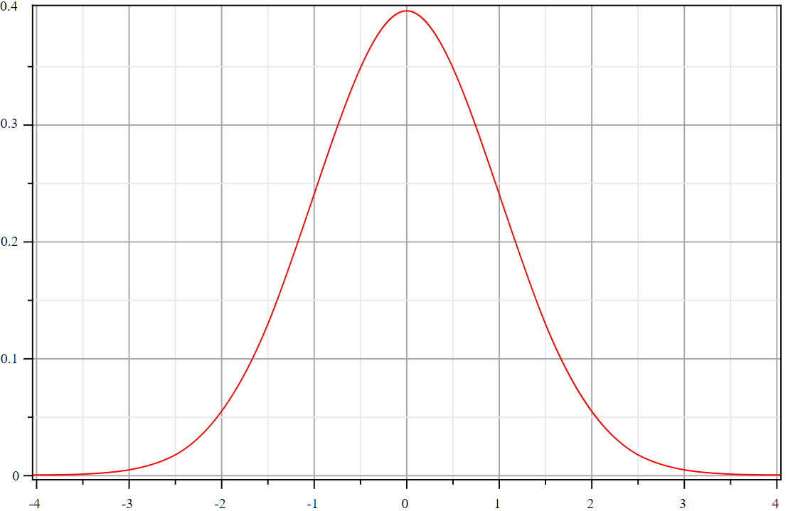
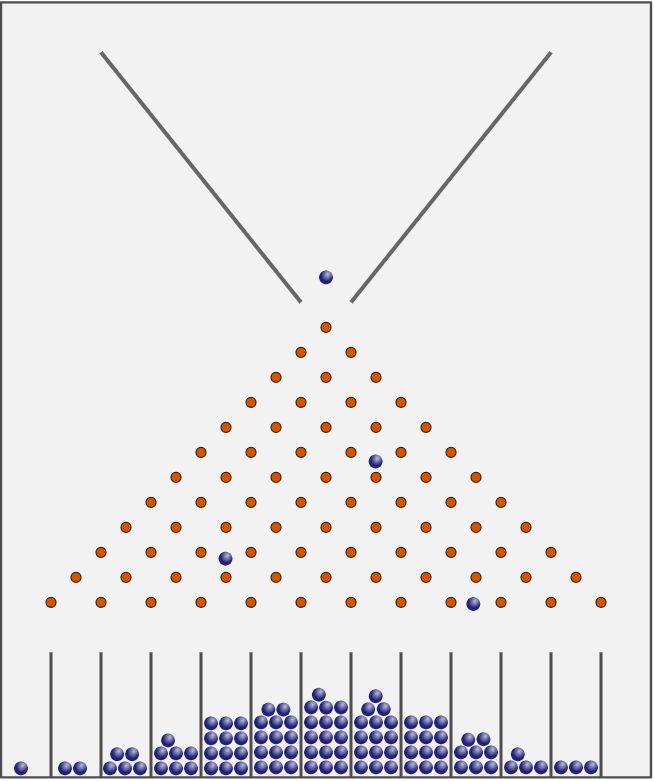
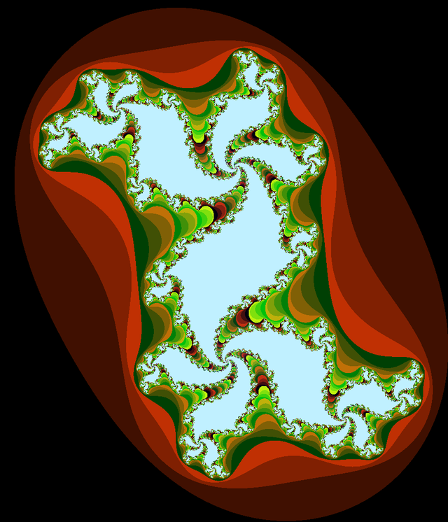

.. index:: histoire, racine carrée, loi normale, Galton, machine de Galton, Chauvet, grotte de Chauvet, mathématiques, langage, science

.. _l-histoire_mathematique_histoire:

Mathématiques, Histoire et Langage
==================================

**+10 ans**

:sharenet:`facebook-twitter-linkedin-20-body`

A en croire l'émission
`d3: Conserver Chauvet, patrimoine mondial <http://www.franceinter.fr/emission-3d-le-journal-conserver-chauvet-patrimoine-mondial>`_
sur France Inter, les hommes préhistoriques peignaient les murs
avec des techniques complexes comme chauffer à 400 degrés
les parois de la grotte. L'astuce dont ces hommes faisaient preuve
est surprenante. Je n'ai pas un tel souvenir du
film `La Guerre du Feu <http://fr.wikipedia.org/wiki/La_Guerre_du_feu>`_
mais c'est un peu plus présent dans le livre
`Pourquoi j'ai mangé mon père <http://fr.wikipedia.org/wiki/Pourquoi_j%27ai_mang%C3%A9_mon_p%C3%A8re>`_.
A quoi ressemblait un chercheur scientifique à l'époque de la grotte de Chauvet si tant est
qu'on puisse concevoir qu'ils existaient ?
Cela devait être une recherche très empirique avec très peu de moyens pour
conserver les découvertes autres que par l'usage que ces hommes en faisaient.

Par la suite, on a inventé l'`écriture <http://fr.wikipedia.org/wiki/%C3%89criture>`_.
C'est un moyen très sûr de garder
une trace de toutes choses, même celles dont on ne se sert plus mais dont
le principe pourrait toujours servir un jour.

Mais cela ne devait pas toujours suffire car les mathématiciens ont eu besoin
d'inventer des symboles pour désigner des objets abstraits qu'il leur prenait l'envie
de citer constamment. La racine carrée étaient connue dans de nombreux pays comme en témoigne
`Histoire de la racine carrée <http://fr.wikipedia.org/wiki/Histoire_de_la_racine_carr%C3%A9e>`_
mais sa définition reste très géométrique et encore à l'état de paraphrase.
La tentation d'écourter son écriture fait son chemin et le symbole qu'on connaît naît en 1525 (lire
`Le symbole racine carrée : √ <http://www.math93.com/index.php/histoire-des-maths/les-symboles-menu/133-la-racine-carree>`_,
`L'histoire des mathématiques : la racine carrée <http://matoumatheux.ac-rennes.fr/divers/histoire/racine.htm>`_).
Ce symbole représente une chose abstraite. Il est possible d'en voir des
`représentations géométriques <http://mathematiques3.free.fr/2troisieme/racinecarree/raci006.php>`_
ou encore de la découvrir dans une formule :

.. math::

    \frac{1}{ \sqrt{2 \pi}}e^{ -\frac{x^2}{2} }

Elle correspond à une courbe très célèbre en forme de cloche :

C'est la distribution de la loi normale qui correspond plus ou moins à la distribution
des tailles dans une population ou celle des billes donnée par la
`machine de Galton <http://therese.eveilleau.pagesperso-orange.fr/pages/truc_mat/textes/galton.htm>`_.

.. index:: pi

Observer la racine carrée de façon concrète n'est pas chose aisée. Et que dire de :math:`\pi` qu'on ne
sait pas définir autrement qu'en récitant la formule de la circonférence du cercle ?
Les symboles mathématiques forment un langage qui donne beaucoup plus d'aisance lorsqu'il s'agit
de décrire des choses abstraites. La formule ci-dessus définit une courbe. La suivante
:math:`f(z_0)=\lim_{\infty} z_n` où la suite la suite vérifie :math:`z_{n+1} = z_n^2 + c`
définit `l'ensemble de Julia <http://fr.wikipedia.org/wiki/Ensemble_de_Julia>`_ :

L'ensemble de Julia est une fractale, concept dont on se sert pour
décrire la forme d'un chou ou celle des côtes Bretonnes mais aussi réfléchir sur
la longueur du litoral (voir `Les fractales pour les nuls <http://brunomarion.com/fr/les-fractales-pour-les-nuls/>`_).
La musique a aussi droit à son écriture à laquelle
`Guido d'Arezzo <http://fr.wikipedia.org/wiki/Guido_d%27Arezzo>`_ a fortement contribué.
C'est comme si, dans plusieurs domaines, un langage était apparu par besoin, pour
dépasser un obstacle qui empêchait les musiciens, les scientifiques d'aller plus loin.

L'imagination humaine exprime toujours des idées de plus en plus complexes bien que nous ne soyons
pas toujours capables de retenir et manipuler celles-ci avec aisance.
Et puis un jour, elle font partie du langage et tout devient plus simple.
On peut alors passer à la prochaine idée encore plus complexe mais finalement
pas beaucoup plus depuis qu'on a inventé les mots pour exprimer les anciennes idées
sur lesquelles elles s'appuient.

L'informatique s'inscrit elle aussi dans ce fabuleux processus et ses récents et rapides progrès
sont liés à la multitude de langages informatiques qui existent aujourd'hui.
Dans ce domaine, le processus d'extension du langage est sans doute un peu plus clair.
Les informaticiens ont horreur de la répétition car ils sont sans doute plus que d'autres
incapables de répéter la même chose sans faire d'erreur. Rien de plus facile alors
que de créer un mot, d'écrire une fonction qui fera dorénavant partie du vocabulaire, ou de créer
un langage dédié à un usage spécifique pour alléger encore la pensée.

Les langages sont aussi visuels comme le plan de métro qui semble si naturel aujourd'hui.
Pourtant, il n'était pas évident d'aboutir à cette représentation épurée qui apparut au début du siècle :
`La représentation cartographique du métro <http://le-cartographe.net/blog/archives/107-la-representation-cartographique-du-metro>`_.
Le langage de la visualisation des données est un domaine qui cogite beaucoup en ce moment,
que ce soit pour l'`Analyse des réseaux sociaux <http://fr.wikipedia.org/wiki/Analyse_des_r%C3%A9seaux_sociaux>`_
ou l'animation de graphes (voir l'outil `d3.js <http://d3js.org/>`_).

.. image:: http://upload.wikimedia.org/wikipedia/commons/9/9b/Social_Network_Analysis_Visualization.png
    :width: 500

*Source des images : wikipedia*
