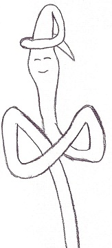
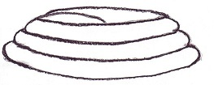

.. _l-modulard:

Modulard le ver de terre
========================

**+7 ans**

:sharenet:`facebook-twitter-linkedin-20-body`

Modulard était un ver de terre assez puissant, du moins selon son entourage.
Il vivait paisiblement parmi les rosiers qui étaient copieusement
nourris et arrosés par les propriétaires de la maison dont la
terrasse abritait justement ces rosiers. Il adorait ces plantes
car elles piquaient tout simplement. Quelques épines s'enfonçaient
sans cesse sous la terre et c'était un plaisir pour Modulard que
d'aller se gratter le ventre au bout de ces épieux. Elles avaient
un autre atout, c'était d'empêcher que les taupes ne viennent creuser
dans le coin, elles détestaient par dessus tout se piquer le nez dessus
et Modulard détestait se faire couper en deux par une patte acharnée
et aveugle. Etre coupé en deux, c'était être deux fois plus petit mais
deux fois plus nombreux et Modulard n'aimait pas beaucoup avoir de la
compagnie. Le seul inconvénient de sa tanière était les rares
labourages du jardinier. Vivre sous la pelouse vous évitait ce
désagrément mais si ce n'était les taupes qui vous découpaient,
c'était la tondeuse qui vous rattrapait. Bien que rares et souvent
sans gravité, ces accidents étaient le lot quotidien des autres vers
de terre sauf pour Modulard et c'était aussi pour cela qu'il était
respecté partout où il passait. Il pouvait prévoir quand et comment
allait survenir le danger. Modulard avait survécu à tout, d'un
écrasement sous les sabots d'un cheval à la danse aquatique au bout
d'un hameçon au cours de laquelle il fallait feindre d'être mort
si on voulait en réchapper et même pas entier. Modulard était le
professeur de tous les vers de terre et enseignait à ses congénères
les goûts et les dangers de la consommation de cocktails à base
d'engrais humains. Son corps avait d'ailleurs très bien su s'adapter :
Modulard pouvait manger n'importe quoi.

Malheureusement, ces temps-ci la vie n'était certes pas plus
dangereuse mais nettement moins agréable. Il est vrai que l'été
est propice à ce genre d'aventures, Modulard aimait se promener
le soir dans la rosée. Cependant, il arrivait fréquemment que ses
petites promenades se terminent avec une "gueule de bois" : le
champagne se renversait sur la pelouse et Modulard rampait à
cinquante centimètres sous terre afin de regagner son terrier.
Ses voisins, un jeune couple, avaient récemment eu un bébé et
avaient décidé de fêter cette arrivée, plus que de raison de
l'avis de Modulard. Il avait en effet mis plus d'une centaine
d'enfants au monde et ne s'était jamais emporté à organiser de
telles fêtes : Modulard aimait la tranquillité. D'ailleurs,
Modulard était sur le point de déménager.

Néanmoins, un de ses nombreux enfants fit une découverte plus
qu'étrange et vint en avertir son père. A quelques dizaines de jours
de son salon, il y avait un cimetière. Un homme était mort récemment.
Il était moins fréquent qu'il soit enterré avec un livre.
Modulard, qui dans sa jeunesse, avait eu tout le loisir d'apprendre
à lire dans ces mêmes occasions, dévora le livre.
C'était un extrait du code civil qu'un juge avait voulu emporter
dans sa tombe. Il énonçait toutes sortes de lois pratiques que les
hommes avaient cru bon de mettre en place. Alors que la
Société des Vers de Terre (SVT) était fondée sur le bon sens,
les hommes avaient construit toutes sortes de règles de vie en
communauté. Elles firent bien rire tous les vers de terre réunis
autour de Modulard et qui écoutaient sa traduction du code civil.
Modulard disait que l'homme est prompt à s'emporter et qu'il pense
souvent moins vite qu'il n'agit. Chez les vers de terre, un tel
comportement est inimaginable, on n'a jamais vu aucun ver de terre
penser moins vite qu'il ne bouge !

Après avoir mûrement réfléchi, Modulard décida qu'il avait des droits
en tant que voisin et qu'il subissait des tapages nocturnes désastreux
pour sa santé. Il organisa donc une petite assemblée au cours de
laquelle il fonda l'Association des Vers Voisins (AVV) et fit le
tour du voisinage à la recherche d'un avocat pour sa défense.
Pendant ce temps, ses nombreux enfants furent chargés de la
récupération de preuves tangibles afin que le tapage nocturne
soit dûment démontré. Des témoins attentifs auraient pu voir des
bouchons de champagne ramper sous les taillis. Il est vrai que la
proportion d'escargots était très élevée ce jour-là. Ces derniers
avaient pris fait et cause pour Modulard.

Modulard estima, pour une occasion d'une telle importance,
qu'il importait d'être parfaitement vêtu. Il se dirigea vers un
arbre dont le tronc creusé abritait un magasin de prêt-à-porter.
Il était tenu par une famille de mille pattes dont les nombreuses
paires de jambes tricotaient toutes sortes d'habits à la chaîne.
Cet endroit était très réputé, les clients appréciaient la qualité
du tissu et les vers à soie qui approvisionnaient la manufacture
avaient tout le loisir de prospérer en toute sécurité. Un couple
d'écureuils très friands de soie avait sculpté un intérieur chaleureux
attenant à leur propre appartement. Arrivé à destination, Modulard
choisit un costume très simple : une chemise blanche surmontée
d'un noeud papillon. Ceux-ci étaient très désirés car, étant
garantis d'origine, c'étaient de véritables ailes de papillon
habilement renforcées de soie. Il fallait maintenant payer ce
costume mais Modulard n'était pas inquiet, ses enfants avaient
sillonné la pelouse et avaient récupéré trois bagues dont une contenait
des diamants. Il laissa le tout, non pas qu'il y eut juste assez pour payer,
mais simplement parce que l'établissement accueillait quelques
vieilles araignées végétariennes qui dirigeaient une banque.
Leur soie était très utile dans la confection d'habits élastiques
très à la mode. Cette entreprise les avaient enrichies de manière
spectaculaire. La banque leur avait semblé un prolongement naturel de
leurs activités. Craintes et respectées, leurs coffres étaient réputés très sûrs.

Modulard reprit son chemin, son costume emballé dans un sac en
plastique (de récupération, taillé par un perce-oreille et fondu
à l'aide d'une colle à base de venin d'araignée dont la recette
est encore tenue secrète). Il emmenait également une trousse de
toilette qui consistait en un ballon en vieille peau de chenille
plein d'eau et d'oignons. Il se servait de l'eau pour sa peau qui
ne devait pas rester desséchée et l'oignon était l'unique parfum
qu'il avait trouvé dans sa longue vie qui faisait fuir les oiseaux
- son avocat était un perroquet qui nichait chez des voisins de pelouse.
Lorsqu'il arriva devant la cage dont il hésitait à franchir les
barreaux, il se lava, se parfuma et s'habilla. Il réveilla ensuite
le perroquet et lui expliqua son cas. L'oiseau était un drôle de
bougre qui parlait beaucoup et comprenait lentement. En effet, pendant
que Modulard, racontait son histoire au volatile, ce dernier
l'interrompait sans arrêt pour répéter ce qu'il venait de dire
comme si c'était le seul moyen pour cet animal de mémoriser.
L'histoire achevée, Modulard voulut s'assurer que son avocat ne
s'était pas mépris, il lui demanda : "Compris ?", son interlocuteur
lui répondit aussitôt : "Compris". Modulard discuta alors la
question des honoraires pour laquelle, bizarrement, le perroquet
ne répétait plus. Ils arrivèrent à une heure de liberté et une
cargaison de moustiques grillés (une friandise très répandue en été,
ceux-ci étaient récupérés par les cafards au pied des lampes et lampadaires,
ils étaient livrés dans des coquilles de noisettes scellées à l'aide
d'ailes de guêpes fraîchement écrasées et collées avec de la bave de cafards,
une bague suffirait amplement à payer ce caviar).
Ils se rendirent chez le juge dont l'adresse avait été récupéré
dans un portefeuille oublié sur la pelouse.

Arrivé chez le juge, le perroquet frappa à la fenêtre de son
bureau au cinquième étage. Le juge travaillait, courbé sur un dossier.
Lorsqu'il se releva, il pouvait voir un perroquet entrer par la
fenêtre avec un ver de terre qui formait une crête au-dessus de sa tête,
l'oiseau ressemblait à un coq. Il se mit à réciter l'affaire de Modulard.
Le juge était sceptique, cela se lisait sur son visage.
Au début, il avait paru agacé d'entendre un perroquet parler d'une voix
péremptoire puis il empoigna un coussin et fit mine de taper sur l'oiseau.
Le perroquet se mit à voler près du plafond tout en racontant son histoire
tandis que le juge bondissait de sa chaise à son bureau en agitant
son petit sac à plumes. La conclusion de ce long discours fut qu'un
ver de terre attaquait ses voisins pour tapage nocturne. Après avoir
entendu la plaidoirie du perroquet, le juge éclata de rire, il sortit
quelques gâteaux et les offrit au perroquet puis se remit
tranquillement à son travail. Modulard essaya de parler au perroquet
afin de le pousser à continuer mais ce dernier essaya vainement de
l'attraper pour le manger et Modulard décida finalement de rester
perché sur le crâne de l'oiseau et d'attendre qu'il revienne au bercail
ce qui arriva une heure plus tard. Modulard rentra chez lui fatigué et désabusé.

Lorsqu'il arriva près du massif de rosier, il réalisa qu'il
n'avait pas rencontré un seul de ses congénères en chemin.
Ce soir était une fois encore un soir de fête chez ses voisins.
Modulard était inquiet de ne trouver aucun autre ver de terre dans les parages.
La nuit était pourtant douce et propice à l'aventure.
D'habitude, il ne se passait pas une nuit sans qu'il ne soit dérangé.
Il se dirigea à contre coe ur vers la maison, persuadé qu'aucun
ver n'aurait été assez fou pour y pénétrer. Il se trompait.
Les jeunes avaient investi le salon dont le canapé en cuir
était jonché de vers de terre. Modulard s'approcha prudemment malgré tout.
Ses enfants lui racontèrent que les oiseaux avaient englouti
quelques frères mais la plupart étaient parvenus jusqu'ici parfumés d'oignon.
Le canapé noir tirait la langue : il était recouvert d'une couche
rose et gluante qui s'enlaçait gaiement.

Modulard les rejoignit, amenant tout son savoir.
Il demanda à tous ses amis de quitter les dossiers afin de faire place nette.
Encore auréolé de son noe ud papillon, il se transforma en chef d'orchestre,
sa grande forme lui permit d'imiter une clé de sol et
s'apprêtait à dicter sa partition. Quelques dizaines de vers,
des plus grands aux plus petits, escaladaient la paroi du dossier,
salivant de toutes leurs forces et se préparant à une longue pose.
Les vers de terre s'allongeaient, s'arrondissaient pour
former le message : "NOUS AERONS LA PELOUSE RESPECTEZ-NOUS".
Une heure s'était écoulée et le message était écrit.
Peu d'entre eux en comprenaient le sens mais tous faisaient
confiance à Modulard. Son prestige s'accrut lorsque
la maîtresse de maison pénétra dans la pièce et repartit
en hurlant à l'invasion. Quelques secondes plus tard,
elle fut suivie de son armée qui s'arrêta net devant le prodige.

Quelqu'un s'exclama : "Où est donc le dresseur de vers de terre ?".
C'est alors que Modulard s'anima, il répondit du tac au tac,
il rampait sur ses petits enfants afin de leur communiquer la
réponse qui fut interprétée d'après ses ondulations comme :
"C'est moi !", et il se dressa, lui, le seul ver de terre
décoré d'un noe ud papillon en papillon. Puis il reprit la
conversation tout en dansant au beau milieu d'un enchevêtrement
rose bien que son public n'y soit pas aussi attentif qu'il l'eût souhaité.
Il faut dire que la surprise était grande. Les vers bougeaient vite,
ils s'échauffaient. Modulard n'en avait cure.
Il raconta en quelques phrases l'étendue de sa vie.
Mais il ne s'arrêta pas là, il songea à ses araignées
qui avaient si bien su développer leur petit commerce et
leur petite banque, Modulard voyait grand, il allait commercer
avec les hommes.

Le succès et la fortune de Modulard furent rapides.
Il proposa des habits en soie d'araignée, proposa du miel
(les abeilles furent ravies, elles n'étaient plus endormie contre leur gré),
inventa même une colle à base de bave de limace mêlée à de
la bave de crapaud. Il imagina la plus grosse société d'exportation.
Ses voisins déplacèrent les rosiers dans un endroit tenu secret
mais à l'abri du bruit. Modulard fonda une école et affermit la
suprématie des vers de terre sur le monde souterrain.
Les humains payaient fort cher en farine, sucre,
fumier et viande fraîche (les mouches et les guêpes en furent ravies).
Un service d'espionnage composé d'escadrons d'insectes volatiles
vit le jour et se montra redoutable surtout la nuit.
Les fourmis, bientôt instruites à l'électronique,
fabriquaient des mini-caméras qui se fixaient aux antennes.
Le français devint bientôt la langue universelle pour les
insectes qui savouraient pleinement leur supériorité sur les
mammifères tels que les souris et les hamsters qui vivaient encore en cage.
Seuls les rats leur causaient quelques ennuis mais eux-mêmes
n'avaient pas encore compris combien il était utile de commercer
avec les hommes, ils oe uvraient pour leur propre compte.
Les taupes elles-mêmes s'étaient adaptées, elles transportaient quiconque
les guidaient grâce à leurs yeux à l'extérieur de leurs galeries.
Modulard avaient même négocié un traité entre taupes et agriculteurs.
Ces derniers consentaient à une réduction des engrais alors que les
taupes creusaient leurs tunnels de manière à aérer au mieux les cultures.

Modulard fut adulé jusqu'à la fin de sa vie,
il fut un sage qui éclaira le monde souterrain.
On lui pardonna son dernier rêve pour lequel il se battit pendant
les dernières années de sa vie : faire en sorte que le sol
soit considéré comme un pays habité par une liste de 3 152 596 espèces
différentes (toutes celles ayant signé le traité) et obtenir un siège
à l'ONU. En contrepartie, Modulard avait proposé un dépistage gratuit
des mines antipersonnelles disséminées ça et là de par le monde et
également une détection automatique des fuites dans les canalisations
souterraines. Malheureusement, Modulard mourut et son projet fut
abandonné car le monde souterrain devait organiser des élections
afin d'élire un successeur. Cela prit trois ans durant lesquels
on ne cessa de se battre tout en se demandant ce que Modulard aurait
fait. Il fallut choisir la forme des bulletins de vote qui furent
simplement l'odeur des candidats car l'odorat était le sens le plus
répandu. La démocratie était en marche, les livres d'histoires aussi.

Modulard avait de nombreux fils, leurs avis furent souvent requis,
et bien heureusement, ils avaient hérité d'un peu de la sagesse de
leur père. Un en particulier, fortement érudit, travaillait à
l'élaboration d'un langage entre un ver de terre et un arbre.
Il s'était inspiré du langage morse et chatouillait les pointes
des racines d'un jeune chêne (de quelques dizaines d'années tout de même).
Il paraît que des travaux récents lui avaient permis d'aboutir
dans ses recherches et pour prouver ses dires, il avait mis en
commun les connaissances de tous les arbres d'une forêt (un travail fastidieux)
et avait pu reconstituer un historique précis des combats de
la première guerre mondiale. Plus récemment, on le sollicita lors de la
recherche des tribus disparus d'Amazonie. Ce ver de terre s'appelait
Midule et était très susceptible (Midule se confond avec mygale).
Il inventa également la mémoire partagée qui consiste à répartir
les connaissances sur plusieurs individus. Midule avait beaucoup
d'élèves et ne se déplaçait jamais sans eux. Il clamait sans cesse
que si l'homme n'avait pas été si orgueilleux, il aurait depuis
bien longtemps inventé ce concept, Midule avait estimé que la mémoire
d'un homme était égale à 546 fois celle d'un ver de terre
(excepté pour Modulard, simplement 37 fois).

Midule fut un sympathique leader d'un monde souterrain qui vivait
une époque dorée. Plus tard, quelques guerres intestines pour
le pouvoir laissèrent quelques traces, notamment sur la couleur
des arbres qui virèrent au rouge sombre. Le monde se stabilisa
lorsque qu'une certaine chenille Einstein mit au point une bombe G nauséabonde
qui déversait en un rien de temps un concentré de touticides
à un kilomètre à la ronde. Le monde devint plus fou mais plus sûr.

Midule eut un fils dont le prénom Tentacule fut fortement inspiré
de la passion de son père pour l'océan, le seul territoire qui
résistait à l'emprise des vers de terre. On raconte qu'il fut
le premier ver à savoir nager mais la légende veut qu'il ait
succombé aux charmes d'une néréide. On l'oublia jusqu'à la
découverte des premiers vers informatique. Il se serait lié
d'amitié avec une torpille électrique un peu trop gourmande.
