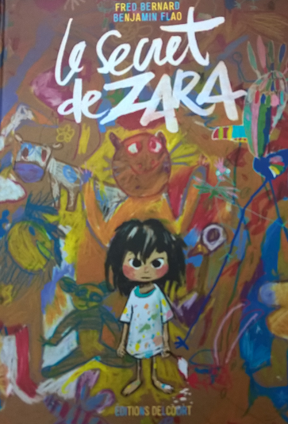
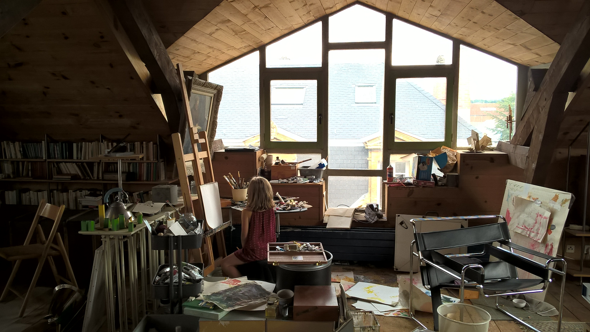
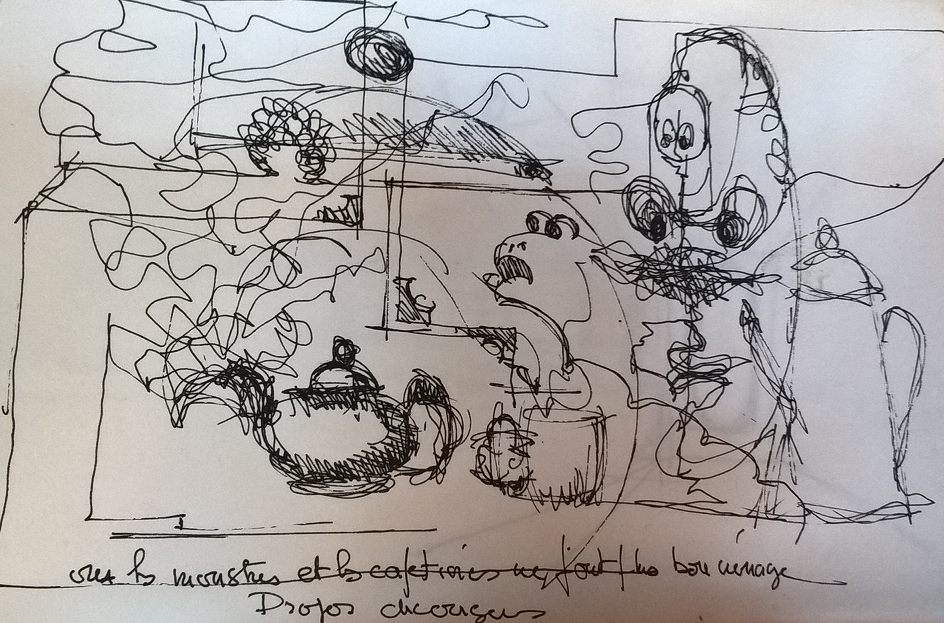

Histoire de peinture
====================

Chez moi, on écrit sur les murs. Les idées
sont faites pour être dessinées quelque part
et il est impossible de rester propre. Les couleurs
débordent sur les vêtements, les mains, le front,
les joues. Comme dans ce livre pour enfants :

Mais c'est un peu comme ça que j'ai grandi.
Les notes sont une chose, mais raconter ce qui
vous fait vibrer, que ce soit un théorème de maths,
la courbe d'un bâtiment, et il faut s'exercer, et
encore s'exercer jusqu'à transformer sa maison
son atelier.

C'est la pièce de la maison que je préfère,
un joyeux espace créatif où tout y est rangé
selon les idées de la veille. Rien n'est pire
que de les perturber avec un chiffon blanc
et une éponge mouillée.

Aucune oeuvre n'est vraiment achevée, certaines nous ont épuisés
jusqu'à ce que plus aucune idée nouvelle ne vienne
les altérer. Il reste alors tous ces bouts de dessins
inachevés et imparfaits qui servent de terreau à de
nouvelles pensées.
