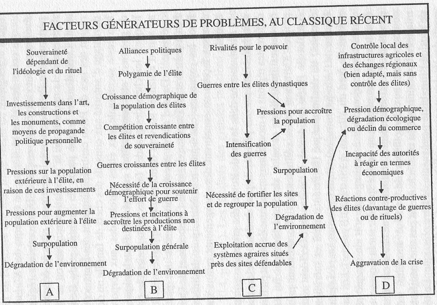

.. index:: histoire, Romains, Mayas, économie

.. _l-rome-maya:

Economie romaine, économie Maya
===============================

**+14 ans**

:sharenet:`facebook-twitter-linkedin-20-body`

Les Mayas se sont éteints après plusieurs siècles de règne.
Leur disparition fut sans doute aidée par l'arrivée des conquistadors Espagnols.
C'est un sort que connut aussi l'Empire Romain bien des années avant.
Les Mayas ont disparu à un moment où leur civilisation était fragilisée et
incapable de réagir après l'arrivée de Christophe Colomb.
L'agonie des Romains a duré plus d'un siècle jusque 475 après JC.

Les deux empires se différenciaient par des économies opposées.
Les Romains se nourrissaient de conquêtes. Leur emprise s'étendaient sur
plusieurs milliers de kilomètres, les esclaves procuraient une main
d'oeuvre bon marché. Ce mécanisme n'est pas sans l'expansion des colons
américains aux dépens des indiens. Chaque nouvelle vague de colons
fournissaient des travailleurs peu chers. La faim les poussaient à travailler
pour les colons déjà présents puis à conquérir de nouveaux territoires vers l'Ouest.
L'armée venait conclure cette conquête jusqu'à l'arrivée de la vague suivante de colons.

Les Mayas étaient confinés sur un territoire géographiquement limités.
Les montagnes allongeaient artificiellement les distances en rendant les
déplacements difficiles, le sol était une ressource limitée. Ces contraintes
expliquent pourquoi leur économie était en quelque sorte fermée ;
le commerce était bien souvent limité aux villes voisines.

.. index:: Kondratiev

Bien souvent, la première chose qu'on retient dans un cours d'économie sont
les cycles de
`Kondratiev <https://fr.wikipedia.org/wiki/Cycle_de_Kondratiev>`_.
Il est difficile d'établir un parallèle entre ces cycles et l'histoire romaine
ou maya surtout en terme de durée. Toutefois, ces deux empires ont disparu
alors qu'ils étaient fragilisés. Les livres cités à la fin de ce
document donnent une vision beaucoup plus précise de ces deux empires,
les paragraphes qui suivent ne font que tracer le schéma du déclin et
peut-être vous donneront envie d'en lire davantage.

Je me suis appuyé principalement sur deux livres `Les Mayas <http://www.tallandier.com/auteur-218.htm>`_ *
d'Arthur Desmaret et
`L'Empire Romain, économie, société, culture <http://www.editionsladecouverte.fr/catalogue/index-L_Empire_romain-9782707135957.html>`_
de Peter Garnsey et Richard Saller.

Economie Maya
+++++++++++++

Il convient de revenir à l'environnement mayas pour donner un rapide aperçu
des contraintes géographiques qui ont façonné leur économie.
Tout d'abord, il faut préciser que les Mayas ne connaissaient pas ou
n'utilisaient pas la roue, elle était sans doute d'un intérêt
nettement moindre que dans les plaines gauloises ou romaines.
Leurs déplacements sont malaisés. Le commerce était limité
puisqu'il fallait compter qu'un voyage sur 25 kilomètres réduisait
les marchandises de 16%, sur 100 kilomètres, c'était un tiers
qui disparaissait simplement pour nourrir le voyageur.
Face à ces contraintes, les Mayas avaient développé une agriculture
ingénieuse pour remédier aux sols souvent pauvres.
Le commerce était limité et le territoire n'était pas extensible.

Aux alentours des années 700-800, ils se produisit une évolution notable
des techniques d'agriculture. Les rendements ont crû.
C'est avec ce progrès technique que l'économie Maya s'est mise à évoluer.
La proportion des agriculteurs décroît tandis que d'autres
professions se développent. Les villes grossissent, le système politique
se développe, se démocratise. La religion se fait plus présente.
Les produits de luxe se multiplient et avec eux le commerce sur de
plus longue distance. Ce progrès technique s'accompagne aussi
d'une croissance de la population encouragée par les élites au pouvoir
qui cherchent à renforcer l'influence de leur ville.

Cette société atteint un nouveau point d'équilibre vers les années 1100
mais cette économie est fragile. Les sols se sont appauvris
à cause d'une agriculture plus exigeante qui peine à nourrir une population accrûe.
La relative prospérité des villes peut décliner au moindre déséquilibre
comme une mauvaise récolte. La guerre, la conquête de la ville
voisine fut une des réponses au manque de vivres.
On fuit la guerre ou la famine à la recherche d'un nouvel endroit où s'installer,
la ville voisine qui, elle-même saturée, ne peut faire face à un afflût de réfugiés.

Il n'est pas possible de savoir si les Mayas auraient pu redresser leur économie
ou si leur empire se serait éteint de lui-même.
Ces guerres locales, propagées d'un bout à l'autre de l'empire,
l'ont affaibli, trop pour résister aux Espagnols.

Economie de l'empire Romain
+++++++++++++++++++++++++++

La croissance caractérise l'économie romaine avec un
territoire en perpétuelle expansion et un commerce florissant.
Chaque pays conquis paye un tribut à Rome, sous forme de denrées et d'esclaves.
Ces derniers fournissent une main d'\oe uvre bon marché qui profite
à chaque couche de la population lui permettant d'élever son niveau de vie.
Les propriétaires s'enrichissent, les paysans se déplacent vers les villes
où ils deviennent tenanciers, certains esclaves sont affranchis,
permettant à ces nouveaux romains ou à leurs enfant de commencer en bas de l'échelle.
La romanisation n'est pas toujours vue comme négative par les notables des
pays conquis. C'est aussi moyen de faciliter les échanges commerciaux et
d'obtenir la protection de l'armée de Rome.

L'armée est un second vecteur d'ascension sociale. Réservée aux romains,
les soldats se battaient avec la perspective de devenir propriétaires
une fois la guerre terminée. Les empereurs étaient de riches propriétaires
et se séparaient d'une partie de leurs terres à cet effet.
Il faut ajouter qu'il n'y avait pas de séparation entre le budget de l'état et celui de l'empereur.

Il fallait plusieurs mois pour traverser l'empire d'un bout à l'autre
mais tout était fait pour faciliter les échanges comme en témoigne
le soin apporté aux routes consolidées et sécurisées.
La robustesse de cette économie a permis à l'empire de taverser plusieurs siècles
et même l'adoption du christianisme.

Au cours du dernier siècle de son existence, les intrusions barbares
étaient devenues plus fréquentes comme le sac de Rome en 410 par les Vandales.
Il était aussi divisé en deux, les empires d'Occident et d'Orient.
L'état romain était beaucoup moins présent que ne peut l'être l'état d'aujourd'hui.
Il est peu probable que des guerres de successions douloureuses expliquent
seules la chute de l'empire. Au terme de sa vie, il était étendu tout autour de la
mer Méditerrannée et il fallait une grande armée pour maintenir les frontières
et contenir les invasions que la diplomatie n'arrivait pas à résorber.

La prospérité économique de l'empire eut pour conséquence une tertiairisation
de l'économie. La richesse des romains eut un effet négatif sur l'innovation
qui stagna. Elle eut aussi pour effet une désaffection des romains
envers leur armée qui dut se réformer pour inclure dans ses rangs
des individus nés hors d'Italie. Il y eut des résistances au sein de la noblesse romaine,
il n'était pas facile non plus de maintenir un empire avec une armée
dont la proportion de romains diminuait tout en conservant des généraux romains.

Au sein d'un vaste territoire, les économies locales ont eu tendance à se spécialiser.
Celle d'Italie s'est tournée vers des productions plus rentable comme
celle du vin au détriment d'autres moins intéressantes comme celle du blé.
L'économie est devenue plus riche mais aussi plus dépendante des autres
régions romanisées. L'empire romain faisait face tout à la fois aux carences
de son armée, à une économie fragilisée car moins diversifiée et moins innovante,
à des successions difficiles à la tête de l'empire.

Ce rapide tableau ne serait pas complet sans un bref retour sur la
condition des femmes dont la liberté n'a cessé de croître au fil des siècles.
A la fin de l'empire, il suffisait que l'un des deux époux veuille divorcer
pour que la mariage soit dissolu. Elles pouvaient hériter des biens familiaux,
les mariages se faisaient sous le régime de la séparation des biens.
Toutefois, ces règles concernaient principalement l'aristocratie romaine, on se mariait
peu chez les Romains.

Ouverture
++++++++++

**Concept**

Le *mariage d'amour* est une chose si répandue dans les contes de fées
qui ont bercé notre enfance qu'il en devient difficile de le
considérer comme un concept récent. La relecture de certains
passages à propros de la liberté des femmes au sein de l'empire romain
m'amène à revenir sur le sens de cette expression.
Le divorce était facilité par la constitution romaine et cette liberté
met en lumière les raisons d'un mariage qui n'est plus forcément arrangé.
Il n'est peut-être pas utile de se pencher sur les raisons
d'une union si on n'a pas la possibilité de se désunir.

Dans les années 1870, après la guerre perdue contre l'Allemagne,
l'Etat Français s'est interrogé sur les raisons de cette défaite.
Par manque de patriotisme, les Français défendaient moins passionnément
leur pays que leurs voisins germains. Manque de passion pour son pays,
manque de passion dans son mariage, mettre progressivement
fin à la coutume des mariages arrangés pour lancer celle des mariages d'amour.
Voilà sans doute le moyen d'insufler plus de passion, et par extension de patriotisme,
dans les méanges français. Ainsi résumée, cette histoire ressemble à un conte de fées,
qui est pourtant bien arrivé bien que cela fût certainement un peu plus
long qu'un coup de baguette magique.

**Bulle**

L'empire Romain comme l'empire Maya n'ont pas su résister et ont disparu à
des moments où ils étaient fragilisés par des événements qui
s'enchaînaient à un rythme plus rapide que celui de leur propre mutation.
Ce schéma de croissance puis d'effondrement s'est reproduit par la suite.
L'économie américaine, en ce début de siècle, fait face à une crise financière
et immobilière qui remet en cause son économie basée sur la consommation.
Par un effet d'entraînement, de nombreux investisseurs se sont tournés vers
l'immobilier surpassant la demande. C'est aussi le cas en Espagne où ce
secteur tirait l'économie du pays vers le haut.

Il est difficile d'anticiper l'impact de telles crises sur l'économie.
Paris n'est pas exempt de ce genre de phénomènes.
L'augmentation des prix de l'immobilier tend à uniformiser la population parisienne
rejetant plus loin du centre ville les familles les moins aisées.
De nombreux petits commerçants ne peuvent faire face à l'augmentation des loyers et
sont remplacés par des boutiques de vêtements, plus rentables, un café remplacé
par une boutique de lingerie, une boulangerie par des produits de beauté...
Il devient également difficile d'étudier à Paris où se nourrir et se loger
n'est pas plus à la portée de n'importe qui.

Ces transformations lentes nous apparaissent souvent lorsqu'il n'est plus
évident de s'y opposer. Il n'est pas plus facile de savoir celles qui
sont souhaitables et celles qui ne le sont pas. Dans économie basée sur
la croissance, elles sont juste inévitables.

**Second Life**

Second Life est un monde virtuel accessible depuis internet. Chacun peut y avoir
un clone qui mène sa propre vie en compagnie d'autres clones.
Une unique monnaie virtuelle, le linden dollars, permet les échanges entre clones.
Le seul lien avec le monde réel, à part l'écran d'ordinateur, est la possibilité
de convertir de vrais dollars en dollars virtuels.

Le taux de conversion est très bas, de l'ordre de un pour mille, et il est
impossible d'en vivre. Toutefois, à l'avenir, on peut se demander
si un tel monde virtuel ne viendra pas perturber l'économique mondiale,
si par exemple, la masse monétaire de ce monde virtuel se mettait à croître,
à générer de la valeur ajoutée.

**Evolution naturelle**

Dans les années 1920-1930, Lotka et Volterra ont imaginé un modèle mathématique
simulant l'évolution de deux populations d'espèces animales, l'une étant les proies,
l'autres les prédateurs. C'est un système chaotique avec deux équations différentielles.

.. math::

    \frac{dx(t)}{dt} = x(t) (\alpha - \beta y(t))

    \frac{dy(t)}{dt} = - y(t) \gamma - \delta x(t))

:math:`x(t)` est la population des proies, :math:`y(t)` celle des prédateurs.
La population des proies croît naturellement avec un taux de fécondité constant
(:math:`\alpha`) et décroît à cause de l'appétit (:math:`\beta`) des prédateurs.
A l'inverse, les prédateurs se reproduisent d'autant mieux si la population
de proies est suffisante (:math:`\delta`) et ils meurent en l'absence de proies
(:math:`\gamma`). Lors des simulations, il apparaît que la population des
prédateurs suit la même évolution que celle des proies avec un temps de retard.
Lorsque les proies augmentent, les prédateurs suivent et se multiplient
tellement qu'ils finissent par épuiser le stock de proies qui se met à
décroître. A son tour, incapable de se nourrir, la population de prédateurs
diminue jusqu'à ce qu'elle soit suffisamment petite pour permettre à
nouveau une croissance des proies.

Toutefois, même si les évolutions des populations paraissent cycliques,
le système n'est pas stable et l'amplitude des mouvements a tendance à croître.
Ce modèle est à rapprocher de celui de l'économiste
`Goodwin <https://fr.wikipedia.org/wiki/Goodwin>`_ qui en 1967 mit en relation
le capital, des biens et la proportion de travailleurs avec un modèle équivalent.

Conclusion
++++++++++

L'économie des empires Romain, Mayas, quelque soit la dominante qu'ils aient
choisie - l'expansion ou une agriculture en adéquation avec l'environnement - conquiert
un espace qui grandit moins vite en terme d'espace ou de techniques
que l'appétit de leurs peuples. Ces deux empires ont été incapables de s'adapter
à de nouvelles conditions économiques, ils ont d'abord décliné
puis ont laissé place à d'autres structures plus aptes à survivre.

Le livre
`Une histoire populaire des États-Unis <http://agone.org/memoiressociales/unehistoirepopulairedesetatsunis/index.html>`_
de Howard Zinn entreprend de replacer deux siècles d'économie
américaine au sein d'un même dessein ancré autour de la conquête de
nouveaux territoires géographiques, économiques, tout comme l'esclavage
et l'expansion furent deux grandes composantes de la bonne santé
économique de l'Empire Romain. Récemment, Al Gore a présenté
une conférence autour des limites écologiques que le modèle économique actuel
a dépassé (voir `Une vérité qui dérange <https://fr.wikipedia.org/wiki/Une_v%C3%A9rit%C3%A9_qui_d%C3%A9range>`_).
Il est peut-être temps d'inventer un autre système économique
plus à même de tenir compte les contraintes écologiques
à moins que Goodwin ne nous affirme que notre promptitude à réagir ne
soit toujours avec un temps de retard.

Il est difficile d'imaginer le déclin du monde tel que nous le connaissons
et l'Histoire montre que le déclin d'une civilisation dépasse l'échelle d'une vie humaine.
Il est tout aussi difficile d'imaginer une vie différente de celle
que nous connaissons, qui fait sans doute partie d'un livre de science fiction.

Oui, mais lequel ?

La succession des empereurs romains tout au long de l'histoire de
l'empire ne s'est pas faite sans heurts. La stabilité de cet immense territoire
fut parfois remise en cause lors d'un passage de témoin difficile.
Ce fut le cas au quatrième siècle, avant et après le règne de Théodose.
Sans remettre en cause le lent processus de désagrégation de l'empire,
cette instabilité l'a sans doute accéléré. L'accession au trône est
devenue au second millénaire beaucoup plus sûre en Europe.
C'est d'ailleurs l'une des raisons qui explique la durée de la présence des
Croisés à Jérusalem. La guerre de succession qui suivit la mort de Saladdin
prolongea d'autant la présence Européenne en terre sainte alors
qu'elle n'était plus réduite qu'à quelques villes
(lire `Les idéntités meurtrières <http://www.livredepoche.com/les-identites-meurtrieres-amin-maalouf-9782253150053>`_ d'Amin Maalouf).
Le découpage des pays Européens n'a plus trop bougé depuis.

Bibliographie
+++++++++++++

cités dans le texte

* `Les Mayas <http://www.tallandier.com/auteur-218.htm>`_ d'Arthur Desmaret
* `L'Empire Romain, économie, société, culture <http://www.editionsladecouverte.fr/catalogue/index-L_Empire_romain-9782707135957.html>`_ de Peter Garnsey et Richard Saller.
* `Les idéntités meurtrières <http://www.livredepoche.com/les-identites-meurtrieres-amin-maalouf-9782253150053>`_ d'Amin Maalouf
* `Une vérité qui dérange <https://fr.wikipedia.org/wiki/Une_v%C3%A9rit%C3%A9_qui_d%C3%A9range>`_,
  documentaire à partir d'une présentation d'Al Gore
* `Une histoire populaire des États-Unis <http://agone.org/memoiressociales/unehistoirepopulairedesetatsunis/index.html>`_ de Howard Zinn

.. index:: Tempus

autres lectures

* `Naissance et mort des empires <http://www.editions-perrin.fr/ouvrage/naissance-et-mort-des-empires/9782262026790>`_,
  livre parfois bâclé (Villepin y a écrit un chapitre sur Napoléon),
  une interview intéressante avec
  `Aldo Schiavone <https://fr.wikipedia.org/wiki/Aldo_Schiavone>`_
  à propos de l'empire Américain
  et de l'empire Romain, armée imposante et entretenue,
  la certitude que tout ira bien tant que l'empire avance (croissance positive, ...),
  la recherche d'un paradis fondé sur un équilibre parfait chez les Romains
  (la peur qu'il s'écroule aurait suffit pour qu'il s'écroule);
  Je recommande la collection Tempus, leurs livres sont très réussis.

* `La fin de l'Empire Romain d'Occident (375-476) <http://www.gregoiredetours.fr/antiquite/monde-romain-antique/george-andre-morin-la-fin-de-l-empire-romain-d-occident/>`_
  de Georges-André Morin, un brin d'histoire dans la digne lignée des manuels
  d'Histoire que l'école française rabâche du collège au lycée.
  C'est une vision de la fin de l'Empire Romain au milieu de ses empereurs
  qui, même si elle est palpitante, s'arrête peu sur la réalité
  économique et sociale de l'Empire. Ce sont des faits, des dates, des noms,
  des guerres, des alliances, des trahisons, c'est un aspect,
  indispensable, mais un aspect seulement.
  En 379, `Théodose Ier <https://fr.wikipedia.org/wiki/Th%C3%A9odose_Ier>`_ instaure le christianisme comme
  religion d'état. Une grave maladie suivie d'une rémission affermiront ses positions.

* `Effondrement <http://www.gallimard.fr/Catalogue/GALLIMARD/Folio/Folio-essais/Effondrement>`_
  de Jared Diarmond, le livre étudie le déclin de populations confinées dans des petits espaces,
  l'Islande déboisée par ces habitants et qui ne peut plus les faire vivre, l'Ile de Pâques aussi déboisée
  qui ne permit plus à ses habitants de construire des bateaux, l'auteur met en lumière l'incapacité de ses
  populations de gérer une ressource limitée sur le long terme.

* `Louis XIV <http://www.editions-perrin.fr/ouvrage/louis-xiv/9782262028237>`_
  de Jean-Christian Petitfils, ce n'est pas seulement le roi Soleil dont
  il est question dans ce livre mais aussi des ministres qui l'ont entouré
  tout au long de son règne,
  `Mazarin <https://fr.wikipedia.org/wiki/Jules_Mazarin>`_ qui assura la régence,
  `Colbert <https://fr.wikipedia.org/wiki/Jean-Baptiste_Colbert>`_ emprunt d'un certain réalisme économique. Ce n'est pas la
  France des quatre mousquetaires. La fin de règne est longue avec un roi
  atteint de bigotterie.

* `Tour du monde d'un sceptique <http://www.payot-rivages.net/livre_Tour-du-monde-d-un-sceptique-Aldous-Huxley_ean13_9782228899680.html>`_
  de Aldous Huxley, les carnets de voyage de celui qui écrivit
  `Le meilleur des mondes <https://fr.wikipedia.org/wiki/Le_Meilleur_des_mondes>`_,
  d'un regard presque détaché, Huxley a transcrit ses réflexions depuis
  l'Inde jusqu'en Angleterre. Même si le livre semble éloigné,
  c'est néanmoins un voyage dans les années 1920, au travers de pays
  qui ne sont pas tous aussi avancés dans leur développement économique.
  Quelques détours dont je vous laisse découvrir lequel est en rapport avec cet exposé :

    Voyager, c'est découvrir que le monde a tort.

    C'est par leur contraire que se manifestent les choses cachées.
    Mais Dieu n'a pas de contraire et il demeure caché.

    Aux Indes, la classe des fonctionnaires se compose d'hommes de bonne famille,
    des gens convenables, et sur le plan de l'éducation, assez instruits.
    En conséquence, ils sont tolérants et bien élevés car l'homme instruit
    sait regarder les choses d'un autre point de vue que le sien.
    Et celui qui a été élevé dans les classes supérieures de la
    société est généralement courtois ; non pas qu'il ne sente
    supérieur aux autres, mais précisement parce que son sentiment
    de supériorité est si profond qu'il a conscience de devoir être
    poli envers les inférieurs, petite compensation à leur infériorité manifeste.

    Dans une époque d'autorité, l'originalité est bien moins prisée que la
    faculté de répéter comme un perroquet les mots des morts illustres et
    même non illustres : l'important est qu'ils soient morts.

    Plus il y a d'hypocrisie en politique, mieux cela vaut.
    L'hypocrisie en soi n'est rien, mais liée à la plus infime parcelle de sincérité,
    elle sert, tout comme le zéro à la droite d'un nombre, à multiplier
    tout ce qu'il peut y avoir de bonne volonté sincère.
    Les politiciens qui affectent les principes humanitaires sont forcées,
    tôt ou tard, de mettre leurs théories en pratique, et d'une façon bien
    plus absolue qu'ils n'en avaient jamais eu l'intention.

    Dès qu'il s'agit de Dieu, nous sommes tous plus ou moins primitifs.

**religion**

* `Au pays de Dieu <http://www.douglas-kennedy.com/site/au_pays_de_dieu_&300&1&1&9782714441089&0.html>`_
  de Douglas Kennedy, les guerres de religion n'ont pas encore disparu,
  cesseront-elles un jour, on se le demande lors de la lecture
  de ce voyage au sein de la *Ceinture biblique*.
  C'est un voyage au sud des Etats-Unis, au milieu des évangélistes,
  des sectes, ... et de la misère. Une réalité qui fait écho à
  ce que disait Marx :

    Le fondement de la critique irréligieuse est : c'est l'homme
    qui fait la religion, ce n'est pas la religion qui fait l'homme.
    Certes, la religion est la conscience de soi et le sentiment
    de soi qu'a l'homme qui ne s'est pas encore trouvé lui-même,
    ou bien s'est déjà reperdu. Mais l'homme, ce n'est pas un être abstrait
    blotti quelque part hors du monde. L'homme, c'est le monde de
    l'homme, l'État, la société. Cet État, cette société produisent
    la religion, conscience inversée du monde, parce qu'ils
    sont eux-mêmes un monde à l'envers. La religion est la théorie générale de
    ce monde, sa somme encyclopédique, sa logique sous forme
    populaire, son point d'honneur spiritualiste, son enthousiasme,
    sa sanction morale, son complément solennel, sa consolation et
    sa justification universelles. Elle est la réalisation fantastique
    de l'être humain, parce que l'être humain ne possède pas de vraie réalité.
    Lutter contre la religion c'est donc indirectement lutter contre ce monde-là,
    dont la religion est l'arôme spirituel. La détresse religieuse est,
    pour une part, l'expression de la détresse réelle et, pour une autre,
    la protestation contre la détresse réelle. La religion est le soupir de
    la créature opprimée, l'âme d'un monde sans coeur, comme elle
    est l'esprit de conditions sociales d'où l'esprit est exclu.
    Elle est l'opium du peuple. L'abolition de la religion en tant que bonheur
    illusoire du peuple est l'exigence que formule son bonheur réel.
    Exiger qu'il renonce aux illusions sur sa situation c'est exiger
    qu'il renonce à une situation qui a besoin d'illusions.

    [...]

    La critique de la religion détruit les illusions de l'homme pour
    qu'il pense, agisse, façonne sa réalité comme un homme sans illusions
    parvenu à l'âge de la raison, pour qu'il gravite autour de lui-même,
    c'est-à-dire de son soleil réel.

    *Critique de la philosophie du droit de Hegel* de Marx.

  Ce propos n'est pas si éloigné d'autres prononcés par Barack Obama qui disait que
  la religion, les armes à feu ou la xénophobie apparaissent parfois comme un
  refuge pour qui connaît une situation précaire. Un certain repli voire un manque
  de discernement en est parfois la conséquence. Version anglaise :

    You go into some of these small towns in Pennsylvania, and like a lot of
    small towns in the Midwest, the jobs have been gone now for 25 years
    and nothing's replaced them. And they fell through the Clinton
    Administration, and the Bush Administration, and each successive
    administration has said that somehow these communities are gonna
    regenerate and they have not. And it's not surprising then they
    get bitter, they cling to guns or religion or antipathy to people
    who aren't like them or anti-immigrant sentiment or
    anti-trade sentiment as a way to explain their frustrations.

* `La Controverse de Valladolid <https://fr.wikipedia.org/wiki/La_Controverse_de_Valladolid_%28t%C3%A9l%C3%A9film%29>`_,
  téléfilm réalisé par Jean-Daniel Verhaeghe,
  scénario de Jean-Claude Carrière, Les indiens sont-ils des Hommes ?
  C'est à cette question que tente de répondre une assemblée chapeautée
  par l'Eglise en 1550. Loin de tout fanatisme,
  cette oeuvre est une véritable discussion sur l'esclavage,
  la recherche de l'exactitude dans l'interprétation des textes religieux.
  Verra-t-on la même controverse avec les robots ?

**le pouvoir**

* `Les mémoires d'Hadrien <https://fr.wikipedia.org/wiki/M%C3%A9moires_d'Hadrien>`_
  de Marguerite Yourcenar, c'est un livre pour ceux qui aiment tout autant la langue
  française que l'Histoire, Yourcenar met ses mots dans la bouche
  d'Hadrien qui conte sa vie au successeur qu'il a choisi, qui présente
  aussi les idées qui ont guidé ses décisions tout au long de son règne.
  On y apprend beaucoup sur la pratique du pouvoir, sur sa pérennité.

* `Le Prince <https://fr.wikipedia.org/wiki/Le_Prince>`_,
  de Machiavel, l'exercice et la conservation du pouvoir dans tout ce
  qu'il a de plus cinique. Que serait ce livre s'il était écrit
  aujourd'hui en tenant compte des moyens de communication d'aujourd'hui...

* `Du pouvoir <http://livre.fnac.com/a1759748/Bertrand-de-Jouvenel-Du-pouvoir>`_
  de Bertrand Jouvenel, ce livre analyse le pouvoir, il s'ouvre notamment
  sur un paradoxe : bien que le pouvoir soit peu à peu passé des
  mains de rois héréditaires aux peuples grâce aux démocraties d'aujourd'hui,
  cette évolution s'est accompagnée d'un accroissement des moyens d'exercer
  le pouvoir. Le brigandisme était chose courante dans les campagnes romaines.

**science fiction (déclin d'un empire)**

* `Fondation <https://fr.wikipedia.org/wiki/Fondation_%28Asimov%29>`_
  d'Isaac Asimov, on ne peut s'empêcher d'être séduit par ce livre
  qui envisage l'inéluctable déclin d'une civilisation.
  Un homme anticipe tout à la fois la chute et la réaction de
  l'Homme par rapport à son agonie sur une période de mille ans.
  Au travers de cette histoire, l'auteur s'interroge sur la capacité des
  hommes à fonder un régime stable sur plusieurs siècles et sur son
  étonnante capacité de survie, issue peut-être de l'incroyable
  hasard qui le fit naître un jour. N'est-ce pas Darwin ?

* `Au tréfonds du ciel <http://www.livredepoche.com/au-trefonds-du-ciel-vernor-vinge-9782253108696>`_
  de Vernor Vinge, et si toute l'Histoire de l'Humanité se retrouvait
  contenue dans un enchevêtrement de programmes informatiques...
  Ce livre n'est pas que ça, c'est aussi un univers de science
  fiction dans lequel les voyages ne s'effectuent pas plus vite
  que la vitesse de la lumière, un peu comme à l'époque de Rome
  où traverser un empire était un voyage d'une année.

* `V pour Vendetta <http://www.bedetheque.com/BD-V-pour-Vendetta-INT-Integrale-7823.html>`_,
  bande dessinée de David Lloyd et Alan Moore,
  cette bande dessinée conte la fin d'un régime totalitaire,
  les hommes sont-ils capables de construire ailleurs que sur des ruines,
  c'est une question que pose cette oeuvre noire.

**série**

* `Rome <https://en.wikipedia.org/wiki/Rome_%28TV_series%29>`_,
  série télévisée HBO, bien que parfois sujette aux raccourcis,
  cette série a le mérite de présenter fidèlement le quotidien des romains -
  aux moeurs assez libres - par l'intermédiaire de deux héros,
  un centurion avisé et un soldat aguerri, loin des batailles et proches du pouvoir.

* `Deadwood <http://www.hbo.com/deadwood>`_,
  série télévisée HBO, retrace la ville d'un ville de chercheurs
  d'or aux confins de l'ouest américain. La dernière ville où vint
  mourir Wild Bill Hicock devient le tombeau du Far West et fusionne
  petit à petit avec les futurs Etats-Unis. C'est aussi une lutte
  incessante pour le pouvoir, loin de tout manichéisme, dans une
  ville qui grandit dans tous les sens du terme.

* `Battlestar Galactica <http://www.scifistream.com/battlestar-galactica/>`_,
  une autre série télévisée diffusée sur la chaîne SciFi,
  le lien avec Rome ne semble pas évident. Sans revenir sur l'intrigue
  de cette série, elle est avant-tout un huis-clos dans l'espace.
  Elle montre comment la préservation du pouvoir, parfois synonyme de
  la survie d'une espèce, ne tient souvent qu'à un fil.
  Faire les bons choix en un instant, un peu l'apanage
  d'Axel Munshine ou le
  `Vagabond des Limbes <https://fr.wikipedia.org/wiki/Le_Vagabond_des_Limbes>`_
  de Ribera et Godard,
  mais cette dernière citation est sans doute trop éloignée cette fois.
  L'avantage d'une série sur l'histoire est de pouvoir faire
  ressusciter les personnages important pour l'histoire.

  * Le 17 novembre 375, l'empereur
    `Valentinien Ier <https://fr.wikipedia.org/wiki/Valentinien_Ier>`_
    meurt d'une crise d'apoplexie sans avoir préalablement réglé sa succession,
    annonçant les préludes d'une lutte intense pour le pouvoir.
  * Le commandant Adama ressuscite au quatrième épisode de la seconde saison,
    ayant survécu à deux balles tirées à bout portant en pleine poitrine,
    coups portés par un cylon (robot à apparence humaine) ayant
    raté sa tentative de suicide. L'histoire est capricieuse parfois.
